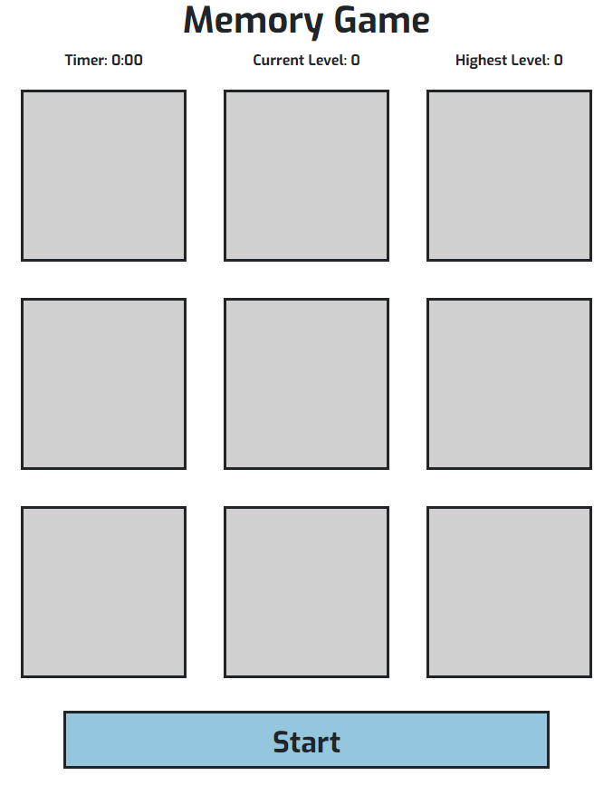
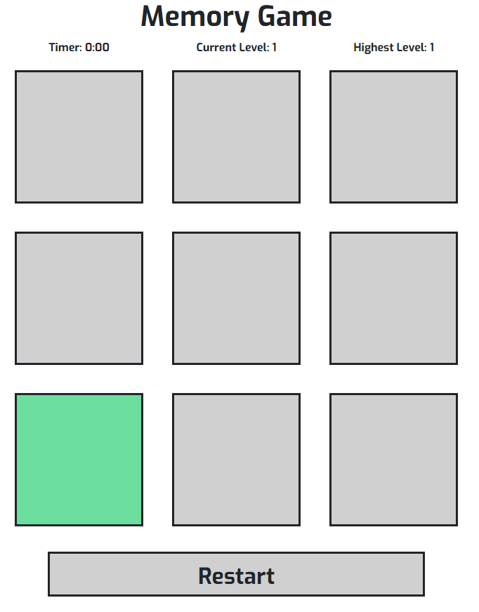
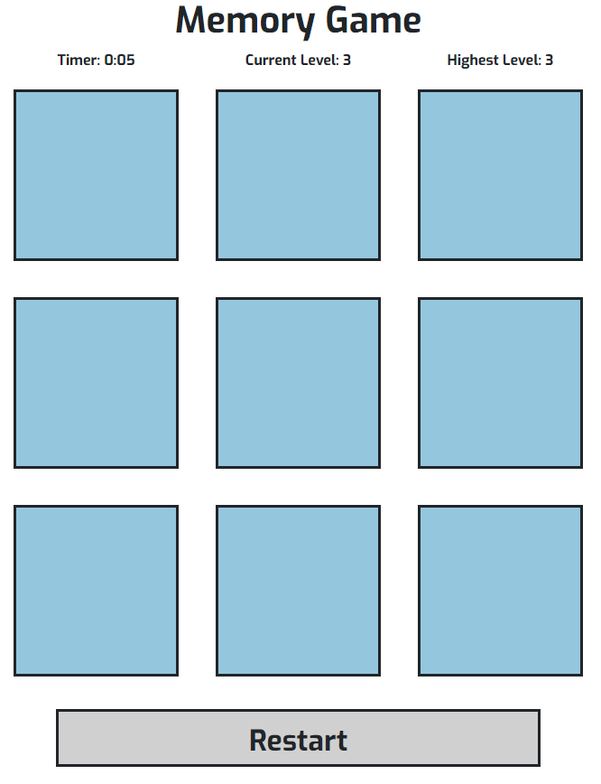
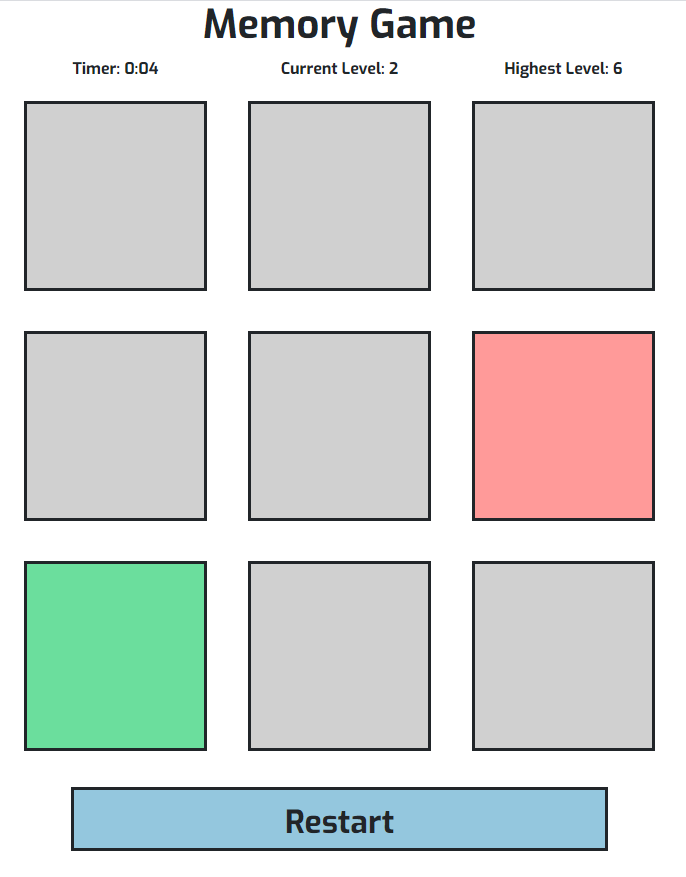

# Memory

## About
I developed a [website](https://FortyTwoFortyTwo.github.io/Memory) for Code Institute's Interactive Frontend Development Project. The website's goal is to have gameplay of Memory game.
The website is designed to be simple and easy to use on any platform or scale.

## Index – Table of Contents
* [User Experience (UX)](#user-experience) 
* [Features](#features)
* [Designs](#designs)
* [Technologies Used](#technologies-used)
* [Testing](#testing)
* [Known Bugs](#known-bugs)

## User Experience
Only one page is made, the game and explaining how to play it.
Box color changes on events, grey as its not able to be clicked, blue as able to be clicked, green as correct box and red as incorrect box.

#### Reasons a user may visit the website
A user looking to play a memory game.

#### Reasons for the website
To play the memory game

## Features

##### Start/Restart Button
Colored blue, pressing it starts the game colored grey and renamed from "Start" to "Restart. When game ends, colored blue to restart game.

##### Memory Game
When game starts, squares will flash green to show which squares to press. If the user selects wrong, game ends with incorrect square colored red and correct square colored green

## Designs

## Technologies used
* HTML5
* CSS3
* [HTML Validator](https://validator.w3.org/) for validity of HTML
* [CSS Validator](https://jigsaw.w3.org/css-validator/) for validity of CSS
* [Bootstrap4](https://getbootstrap.com) for the grid layout, components and styling
* [Git](https://git-scm.com/) for version control.
* [GitHub](https://github.com/) for the repository to store the files.
* [GitHub Pages](https://pages.github.com/) to deploy the site.

## Testing
| Test Label | Test Action | Expected Outcome | Test Outcome |
| --- | --- | --- | --- |
| HTML Validator | Check for any warnings or errors at [HTML Validator](https://validator.w3.org/) | No warnings or errors reported | PASS |
| CSS Validator | Check for any warnings or errors at [CSS Validator](https://jigsaw.w3.org/css-validator/) | No warnings or errors reported | PASS |
| Opening browser | Opening the website browser by google chrone, microsoft edge and phones | Website can be opened | PASS |
| Screen Size | resizing screen for any sizes above 300 pixels | Website is responsive when screen changes size to fit | PASS |
| Selecting grey square | Selecting grey square before pressing start button | Nothing happens | PASS |
| Selecting start button | Selecting start button colored blue | Round starts, one of the square flashes green, then all squares colored blue | PASS |
| Selecting start button mid-game | In mid-game, select start button colored grey mid-game | Nothing happens | PASS |
| Selecting correct square | In mid-game, select blue square that was flashed green | Selected square flashes green, starting next round | PASS |
| Selecting incorrect square | In mid-game select blue square that was not flashed green | Selected square colored red, correct square colored green, ending the game | PASS |
| Timer end | In mid-game, do nothing and let timer ends | Timer ticks down every second, ends the game when timer reaches zero | PASS |
| Restart Game | After game ends, press restart button colored blue | Game restarted and starts again | PASS |

## Known Bugs
There are currently no known bugs